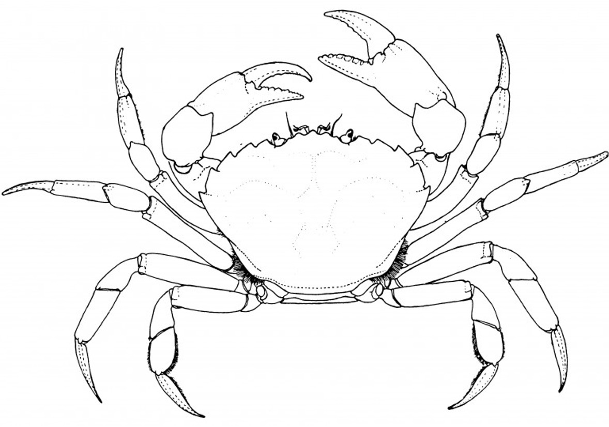

# New England Crabs

- Learning crab anatomy with live crabs
- **Target Age Group:** K-12

## Materials:
- European Green crabs 
- Gloves 
- Cleaning supplies (spray, towels)
- White bins
- Styrofoam cooler boxes
- 4L jug of saltwater
- Cut up oyster bits
- Long tweezers
- Green crab coloring [prints](https://github.com/GWLab-UML/Outreach/blob/main/Activities/Crab%20Anatomy/CrabColorPrint.docx)
- Colored penciles/markers/crayons if needed

## Activity:
1. Each group gets a crab in a clear container
    - 3 groups, ~10 kids per group & 1 lab person per group
2. Introduce the species 
    - Very common in MA, invasive species, body can grow up to 4” not including legs
3. Lab person takes out crab and lets them see it closer, touch it
    - Remind kids that crabs pinch! Can go one-by-one so they all can touch it safely if they want to
4. Lab person sex crab
    - While holding it, flip it over to show the tummy then if you see a big triangle it’s a female and if you see more of a column shape it’s a male - eggs will be orange and spilling out from the female’s big triangle
5. Put crabs in big open top bin on the table so kids can see how they move
    - Warn them not to touch! (since we will stay with our group the whole time, we can keep an eye on them)
6. Give them the paper with the crab to color in and/or a plate to draw the crab themselves!
7. Side activity if any of the kids look bored - draw what crabs eat! 
    ○	Snails, worms, algae, eelgrass/seaweed 

